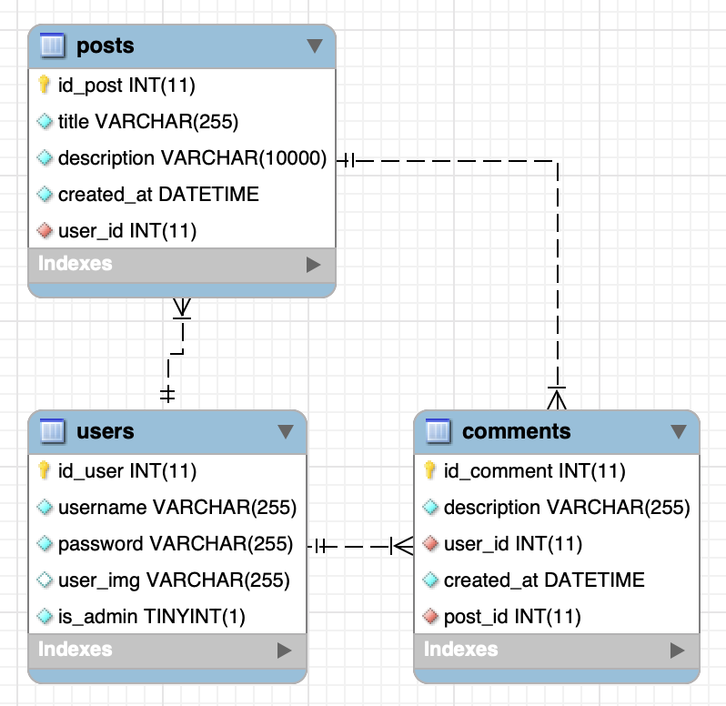

# U-Posting App 

### Simple fullstack app for creating and sharing posts

---

## Preview

[U-Posting App (https://uposting.netlify.app/)](https://uposting.netlify.app/)

- Frontend hosted on [Netlify](https://www.netlify.com/)

- Backend hosted on [Heroku](https://www.heroku.com/)

---

## Installation guide

To run this project locally, follow the steps below:

- Install [Node.js](https://nodejs.org/en/)
- Clone the repository to your local machine
- For Frontend Development
  - Go to frontend directory `cd client`
  - Run `npm install` to install all the dependencies
  - Run `npm run dev` to start developing the app
- For Backend Development
  - Go to backend directory `cd server`
  - Run `npm install` to install all the dependencies
  - Run `npm run run` to start developing the app

---

## Features

- User can create an account
- User can login
- User can create a post
- User can view all posts
- User can view a single post
- User can comment on a post
- User can view all comments on a post
- User can delete a post
- User can delete a comment
- User can edit a post

---

## Technologies

- React
- Redux
- Node
- Express
- MySQL

---

## Database Schema

